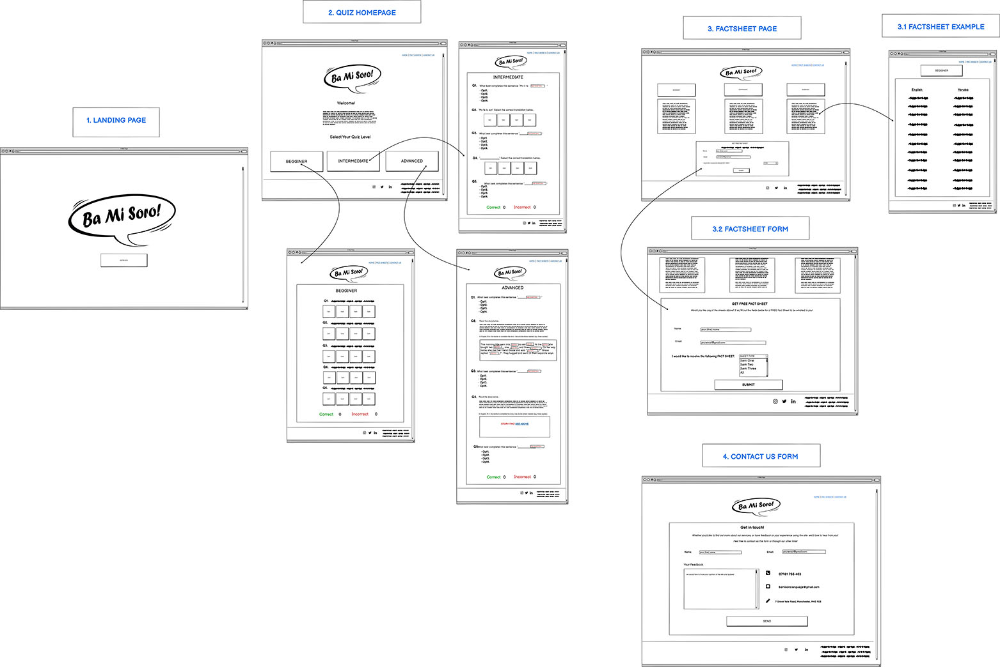

# List of Contents

1. [Overview](#1-Overview)
2. [User Experience (UX)](#2-User-Experience-UX)
3. [Content](#3-Content)
4. [Features](#4-Features)
5. [Technologies Used](#5-Technologies-Used) 
6. [Testing](#6-Testing)
7. [Deployment](#7-Deployment)
8. [Credits](#8-Credits)
9. [Acknowledgements](#9-Acknowledgements)
10. [References](#10-References)

## 1. Overview

# Ba Mi Soro! 

In a country that speaks over 200 languages, Yoruba is one of most common spoken languages in Nigeria, (spoken by more than 15% of the country’s population).

“Ba Mi Soro!” is a Yoruba phrase that translates to “Talk to me!”. The Ba Mi Soro (BMS) website provides interactive quizzes and phrase sheets designed to test users’ understanding of the Yoruba language. 

**Features Overview** 

There are three quizzes which vary in difficulty and the variation in difficult is reflected in the (downloadable) phrase sheets also. The quizzes have been designed to appeal to, and challenge, a variety of users (e.g. of different age groups and abilities in speaking Yoruba). 

## 2. User Experience (UX)

The [‘5 Planes of UX Design Model’ (5PUXD)](https://medium.com/designcentered/ux-design-5-planes-method-b1b1d6587c05#:~:text=The%20five%20planes%20%E2%80%94%20strategy%2C%20scope,the%20problem%20as%20a%20whole) provides **five** core principles used when creating websites and applications.These principles are: 

- Strategy
- Scope
- Structure
- Skeleton
- Surface

The **Strategy** and **Scope** plane in the 5PUXD model suggest that consumer trends, needs and competing services should be considered before designing applications. Arguably, these factors are essential to identifying the core deliverables of the application and its services being offered. It also helps designers clarify the applications’ relevance withing the respective industry and potential market demand.

As such, brief market research was conducted to gain insight into competing services (e.g. existing language applications) and user psychographics. It also helped identify BMS’ target audience and the perceived objectives (goals) of the site owner and users’ (first-time and re-occurring) who visit BMS. This is discussed in more detail below.

### **2.2 Competitor Analysis**

As part of competitor analysis, the following language applications were reviewed. Analysis of such applications assisted in the conceptualisation and creation of BMS’ User Experience Deign. 

Below is a list of some of the websites and applications reviewed:

- [Duolingo](https://www.duolingo.com/)
- [Rosetta Stone](https://www.rosettastone.co.uk/lp/s1rsu/?cmp=evrev&utm_campaign=AW_Brand_NU_UK_ENG_Rosetta_Stone&gclid=CjwKCAjwoNuGBhA8EiwAFxomA-wUuYgJm4qTl1x16lP-8O47sP59mbLy7LMuiLFO-BTCp52AsadiphoCwjMQAvD_BwE)
- [Babbel](https://begin.babbel.com/en_gb/new-multilanguage-selection/?bsc=gg_br_srh_eng_all&btp=default&gclid=CjwKCAjwoNuGBhA8EiwAFxomA3PV_ccC_oIURV3Jgk7urDH32H87msg8c2d4VLRV6cEboIpcTHM20xoCgp8QAvD_BwE&utm_content=292390365_17797833525_kwd-96813789_73803153885&utm_medium=cpc&utm_source=google)
- [Speak Yoruba (Android & iOS App)](http://www.speakyorubaapp.com/)
- [Yoruba 101 (Android & iOS App)](https://play.google.com/store/apps/details?id=air.yoruba101&hl=en&gl=US)
- [Learn Yoruba in easy steps (Android & iOS App)](https://play.google.com/store/apps/details?id=com.tenacity.android.yoruba)

**2.2.1 Valuableness of BMS** 

While the Yoruba language is commonly spoken in Nigeria, it can be argued that compared to ‘Romance languages’ (e.g. Spanish, French, Italian etc.); there are considerably fewer resources (e.g. classes, applications certified courses) that teach the language outside of the country. As such BMS intends to: 

- Add to the educational resources that teaches the Yoruba language. 
- Provide a taster of the language through interactive learning. 

**2.2.2 How does BMS differ competitors?**

As the core aim of the BMS is to add to educational resources that teaches Yoruba, the BMS does not differ considerably from other applications and websites that teach the Yoruba language. 

### **2.3 Key Psychographic(s)**

Prior to creating the BMS website, some market research was conducted in the hopes to gain insight into users’ expectations when engaging with resources designed to assist in learning a language.  

The following questions were sent to a group of users who have interest in and/or are actively learning language(s) aside from their mother tongue: 

1. Do you and/or peers (e.g. friends, children, siblings, parents, partner) communicate more than one language?

If you **cannot speak** multiple languages, but would be interested in learning to:

2. Why would you like to learn another language? 

3. Which type of resources would you like to engage with when learning another language: 
 
    - Conversation with others
    - Books
    - Applications (quizzes and games)
    - Videos (TV shows/ YouTube)
    - A mixture of the above

If you **can speak** multiple languages:
 
4. What other language(s) can you speak?

5. How did you learn to speak other language(s)? 

6. Did you use any of the following resources to aid your learning? 

    - Conversation with others
    - Books
    - Applications (quizzes and games)
    - Videos (TV shows/ YouTube)
    - A mixture of the above

7. If you were to teach, or are teaching younger peers (e.g. your children) additional language(s) (e.g. ‘your native tongue’), which resources do you feel they would respond well to when learning the language:  

    - Conversation with others
    - Books
    - Applications (quizzes and games)
    - Videos (TV shows/ YouTube)
    - A mixture of the above

The users’ responses were documented in the table below:

|Q/User| User 1 | User 2 | User 3 | User 4| 
|-------------|:-------------:|:-------------:|:-------------:|:-------------
|Q1.|N/A| N/A| N/A | N/A |

The key demographics and goals of users’ and site owners were identified through the findings derived from the market, competitor, and psychographic analysis. These factors are discussed in more detail below. 

### **2.4 Key Demographic(s)**

- Age: 8-50
- Sex: Men and Women

### **2.5 User stories: Site Owner and User goals**

#### **Goals: First-time user** 

1. Play an online quiz that can be accessed anywhere on different devices.

2. Test personal knowledge of the Yoruba language for leisure and educational purposes.

#### **Goals: Re-occurring user** 

3. Play an online quiz that can be accessed anywhere on different devices.

4. Test personal knowledge of the Yoruba language for leisure and educational purposes.

5. Strengthen ability in understanding the Yoruba language in more complex contexts (e.g. increased comprehension). 

#### **Goals: Site Owner** 

6. Provide a front-end accessible quiz. 

7. Ensure that the quiz can be accessed by users on most devices (i.e phone, tablet, laptops, and desktops).

8.  Provide content that:

    - Assists user’s knowledge and development of the Yoruba language.
    - Challenges users’ varying ability and/or understanding of the Yoruba language.
    - Can help different age-groups learn Yoruba.

9. Provide users with feedback on their quiz score.

10. Gain users’ feedback on the usefulness of the application.

## 3. Content

This section discusses various design elements of the BMS website. Formulating and executing such elements were integral the development of the BMS site. Arguably, consideration of these factors echoes the premises of the latter planes of the 5PUXD Model. For instance, when designing the BMS site, it was essential to identify the required information of the site (structure) and how users can access this content (skeleton).

### **3.1 Wireframes** 

The wireframes below were drawn up before physically creating the BMS site. Each page shall be discussed in more detail in the features section of this README. Creating the preliminary mock-ups of the BMS site helped to highlight the limitations and strengths and weakness of the BMS design. It also allowed a more accurate analysis of which design elements were feasible to execute within the project time frame and which could be implemented if the BMS site could be expanded on if the project development were extended.   

#### **Initial wireframes (above)** 

The initial wireframes above were greated for the BMS site. However, at later stages of the site's development, additional wireframes were created to clarify yhte current structure of the BMS website. 

#### **Reviewed wireframes (below)** 

Revisions were made to the wireframes after assessing the degree to which the website's design could be executed effectively. 

Given the complexity of the initial website design, factors such as programming skill level, and project timeframe informed the perceived feasibility of creating the site. In turn, these considerations influenced the amendment of the website's initial wireframes. 

The wireframes for the website's current design can be found in the following [directory](/docs/wireframes).

### **3.2 BMS Logo**

The logo for the site was created and illustrated through the following software:

- Adobe Illustrator
- Adobe Photoshop
- Adobe InDesign 

Arguably, language is a salient factor of effective communication. With this in mind, the speech bubble has been used as the logo’s primary form as the shape is one of the most iconic and universally known symbols used to connote speech, language and communication. 

With reference to colour choice, the orange shapes were used to convey the idea of ‘popping’/ lively conversation. This concept also influenced the decision to use the colour orange as it too is often used to convey liveliness and evoke positive moods. Further, orange is commonly used in learning resources (Shiftelearning.com, 2019). 

### **3.3 Fonts**

 

- **Monserat**: To compliment the BMS logo, this san-serif font was used primarily for the headings included on the site. The letters are spaced out considerably and therefore likely to have greater readability than script typography. 

- **Roboto**: When previewed on Google fonts, this font appeared to compliment Monserat the most and it too is rounded which often conveys soft tones and perceived approachableness. 

### **3.4 Colour Pallet**

The following colours were use on the BMS site. The colours’ rgba values were used in the source code rather than the hex values as the rgba values allowed the opacity of the colours to be adjusted where needed and reduce verboseness within in the css source-code. Moreover, the colours’ opacity was adjusted in some instances to convey depth and subtle differences.

- [#FF0000](https://www.webfx.com/web-design/hex-to-rgb/#FF0000/)
- [#EF823E](https://www.webfx.com/web-design/hex-to-rgb/#EF823E)
- [#9ACD32](https://www.webfx.com/web-design/hex-to-rgb/#9ACD32)
- [#9018F1](https://www.webfx.com/web-design/hex-to-rgb/#9018F1)
- [#5D5D5D]( https://www.webfx.com/web-design/hex-to-rgb/#5D5D5D)
- [#5A5757](https://www.webfx.com/web-design/hex-to-rgb/#5A5757)
- [#FFFFFF](https://www.webfx.com/web-design/hex-to-rgb/)

## 4. Features

This section provides an overview of the features on the BMS  website, and where relevant, the way in which theses feature(s) address the users’ stories, mentioned in prior sections.

### **4.1 Enter Page**

- logo hover 
- enter site button 

| User Type |User Story Number| Description| Supporting Statement|
|-----|-----|-----|-----| 
| -------------------|--------------| ----------------|-------------- | 

### **4.2 Quiz Landing page**

- Quiz links ( and hover) 
- Internal links to internal pages
- Social media icons in footer 
- Logo in top left corner

| User Type |User Story Number| Description| Supporting Statement|
|-----|-----|-----|-----| 
| -------------------|--------------| ----------------|-------------- | 

#### **4.2.1 Beginner Quiz**

- Question complexity 
- Multiple choice buttons

| User Type |User Story Number| Description| Supporting Statement|
|-----|-----|-----|-----| 
| -------------------|--------------| ----------------|-------------- | 

#### **4.2.2 Intermediate Quiz**

- Question complexity 
- Multiple choice buttons

| User Type |User Story Number| Description| Supporting Statement|
|-----|-----|-----|-----| 
| -------------------|--------------| ----------------|-------------- | 

#### **4.2.3 Advanced Quiz**

-  Question complexity 
- Multiple choice buttons

| User Type |User Story Number| Description| Supporting Statement|
|-----|-----|-----|-----| 
| -------------------|--------------| ----------------|-------------- | 

#### **4.2.4 Quiz Results page**
- Play again
- Return Home 
- Score Hidden 

| User Type |User Story Number| Description| Supporting Statement|
|-----|-----|-----|-----| 
| -------------------|--------------| ----------------|-------------- | 

### **4.3 Phrase Sheets page**
- Beginner, intermediate, advanced 
- Download function

| User Type |User Story Number| Description| Supporting Statement|
|-----|-----|-----|-----| 
| -------------------|--------------| ----------------|-------------- | 

### **4.4 Contact us form page**
- Contact form 
- Feedback box

| User Type |User Story Number| Description| Supporting Statement|
|-----|-----|-----|-----| 
| -------------------|--------------| ----------------|-------------- | 

### **4.5 404 page**

| User Type |User Story Number| Description| Supporting Statement|
|-----|-----|-----|-----| 
| -------------------|--------------| ----------------|-------------- | 

### **4.6 Future Features**

- Quiz images, audio based questions provides learner with an additional learning mediums, for differing learning intelligences (e.g. visual and auditory learners) 
- Playlist of video resources / link to amazon bookstore for further literary resources. 
- Hide the quiz scores 
- Mini animations when button is clicked (link relevant example) 

## 5. Technologies Used

### **5.1 Languages**

- **HTML**: This source code supported the fundamental structure of the website. 

- **CSS**: This source code supported the core styling elements of the website.

- **JavaScript**: This source code supported the dynamic features/capabilities of the website. For instance;
    -  JS script was used to instigate the colour change of the quiz buttons when the right or wrong answers were clicked on.  
    - JS script was also used to enable the hiding and appearing function of the scores once the quizzes were completed. elements of the website. 

- **JQuery**: Supported specific functionalities (e.g. the scroll button) within the site through simplifying ‘Document Object Model’ (DOM) manipulation (Developer.mozilla.org, 2021).

### **5.2 Applications, Libraries and Resources**

-	[Adobe Creative Cloud](https://www.adobe.com/uk/creativecloud.html): 
    - Illustrator (AI)
    - Photoshop (PS) 
-   [Balsamiq]( https://balsamiq.com/)
- [Bootstrap](https://getbootstrap.com/)
- [Cite This for Me](https://www.citethisforme.com/)
-   [Font Awesome](https://fontawesome.com)
- [GitHub](https://github.com/)
-   [GitPod](https://www.gitpod.io/)
-   [Google (Chrome) Development Tools](https://developer.chrome.com/docs/devtools/open/)
-   [Google Fonts](https://fonts.google.com/)
- [Google Translate](https://translate.google.co.uk/)
-   [Pexels](https://www.pexels.com/)
-   [Pixabay](https://pixabay.com/) 
-   [Pinterest](https://www.pinterest.co.uk/) 
-   [Responsively](https://responsively.app/download) 
-   [Stack Overflow](https://stackoverflow.com/)
-   [VSCode](https://code.visualstudio.com/)
-   [W3 Schools](https://www.w3schools.com/)
-   [W3.CSS](https://www.w3schools.com/w3css/default.asp) 
-   [Youtube](https://www.youtube.com/) 

### **5.3 Testing Applications** 

The following applications were used to test various aspects of the website. Meeting these requirements were essential to the BMS site complying with accessibility, coding and performance standards within the programming industry.

-   [Dillinger](https://dillinger.io/)
-   [(Jigsaw) Validator](https://jigsaw.w3.org/css-validator)
- [JSHint](https://jshint.com/)
-   [Lighthouse](https://developers.google.com/web/tools/lighthouse)
-   [Wave](https://wave.webaim.org/)
-   [W3C Validator](https://validator.w3.org/)

## 6. Testing

## 7. Deployment

### 7.1 Deployment: Local Clone 

The Ba Mi Soro website was deployed locally via the use of GitHub (web application), Git Bash, an IDE such as VS Code (desktop application, and the use of a ‘repo’ - specific SSH Key. An overview of how the site was deployed locally is discussed in more detail below: 

|The Process| 
|-------------|
|Note: You will need this key to clone your repo to your local space (e.g. on your desktop).|
|1.	Download the GitBash application and create a SSH key. How to create a SSH key can be found [here]( https://inchoo.net/dev-talk/how-to-generate-ssh-keys-for-git-authorization/).|
|2.	Sign into [GitHub](https://github.com/).|
|3.	Click your profile icon in the top-right corner of the GitHub webpage, click **Settings**.|
|4.	Click SSH and GPG Keys tab on the left-hand menu.|
|5.	Click **‘New SSH Key’**, then copy and paste your key code (created via GitBash) into the box under the **’Key’** title.|
|6.	Click **’Add SSH Key’**., your key will then be ready to use!|
|7.	Click the **’+’** icon in the top-right icon on the web browser and select **‘New Repository’**. You will then be directed to a webpage titled ‘Create a new repository’.| 
|8	Fill out the required areas. Ensure the repository has been assigned a name and has a README.md created. The README file can be added by selecting the **'Add a README file'** option at the bottom of the ‘Create a new repository’ form.|
|9. Copy your SSH key from your repo. To do this:
|9.1 Open GitHub and navigate to the repo you want to clone.|
|9.2 Click the **’Code’** button in the top-right corner of your repo window.|
|9.3 Click the SSH Key tab.|
|9.4 Copy the SSH key via right click and copy or clicking the clipboard icon.|
|10. On your desktop, open VSCode.|
|11. On the taskbar at the top of tab, click the **File** tab.|
|12. Select the folder you want to clone your repo to.|
|13. In the terminal box, type **‘git clone’**.|
|14. Then copy your SSH key after the git clone command. Then press enter.|
|15. The terminal should present the pathway to your cloned repository. For instance, this “Ba Mi Soro!” project will display the following in the VSCode’s terminal:| 
|- **…C:\Users\missm\Documents\GIT\ba-mi-soro>**|
|16. Once cloned, you will be able to edit your repo locally and commit, pull and push changes to your online GitHub repo (remote repository) using terminal commands (e.g. 'git push', 'git add .' and 'git pull').| 

### 7.2 Deployment: GitHub Pages

Below is an overview on how to deploy a project via GitHub’s GitHub Pages. This method was used to deploy the “Ba Mi Soro!” website:

|The Process| 
|-------------|
| 1. Create a project **repository** on [GitHub](https://github.com/) using a registered GitHub account.|
|2. Once the repository is created, click on the repository, then the **Settings** tab, this is the last tab in the top right of the repository’s **navigation bar**.|
|3. Once on the settings page, navigate to and click on **Pages** (titled as ‘Pages’ as of May 2021) listed in the left-hand menu pane.|
|4. Under the header - **Source**, select **master branch**  from the drop-down list. This will change the neighbouring selector box to **/(root)**.|
|5. Then click **Save**.|
|6. Wait for a minute and then **refresh** the webpage.|
|7. Once refreshing, a green box with the text and clickable link; **'Your site is published at...'**.| 
|8. Clicking on the website’s hyperlink in the green box will direct to the live deployed website.|

## 8. Credits
## 9. Acknowledgements
## 10. References

Several resources have been referred to throughout the development of the 'Ba Mi Soro!' website. A list has been provided, below: 

### Books

- **C.P.A Inc., 2019.** The Computer Programming Bible. 1st ed. C.P.A INC.
- **Duckett, J., 2014.** JavaScript & JQuery: Interactive Front-End Web Development. John Wiley & Sons.
- **DuRocher, D., 2020.** HTML and CSS QuickStart Guide. 1st ed. ClydeBank Media LLC.

### Online Resources 

- [Code Institute, 2020. Anna Greaves README Video](https://www.youtube.com/watch?v=7BteidgLAyM&list=PLH7H7OKKWG3QDcR2PuS9_JGeh6Q_5EUWl&index=2&t=427s)

- [codeSTACKr. 2019. Learn CSS Grid in 20 Minutes](https://www.youtube.com/watch?v=0-DY8J_skZ0)

- [codeSTACKr. 2019. Animated Hamburger Menu Tutorial – CSS Effects](https://youtu.be/dIyVTjJAkLw)

- [C., R., 2021. Arrow function syntax (=>) is only available in ES6 (use 'esversion: 6'](https://stackoverflow.com/questions/42866159/arrow-function-syntax-is-only-available-in-es6-use-esversion-6)

- [Delise, A., 2020. Responsive CSS Grid Tutorial](https://www.youtube.com/watch?v=68O6eOGAGqA&list=PLH7H7OKKWG3T0SAJxSVBxr-Qz-219iWeH&index=16)

- [Do, Q., 2016. A table row was 2 columns wide, which is less than the column count established by the first row (3)](https://stackoverflow.com/questions/36951492/a-table-row-was-2-columns-wide-which-is-less-than-the-column-count-established)

- [ESLint - Pluggable JavaScript linter. 2021. Rule dot-notation](https://eslint.org/docs/2.0.0/rules/dot-notation)

- [freeCodeCamp.org. 2020. How to Center Anything with CSS - Align a Div, Text, and More](https://www.freecodecamp.org/news/how-to-center-anything-with-css-align-a-div-text-and-more)

- [Gallagher, J., 2021. Document.getElementByID is not a function Solution | Career Karma](https://careerkarma.com/blog/javascript-document-getelementbyid-is-not-a-function/#:~:text=The%20JavaScript%20getElementById%20method%20selects,function%20error%20in%20your%20program)

- [GeneratePress. 2021. Tom - Lead Developer | 15th April 2016 #187200 | Shadow under nav bar - GeneratePress](https://generatepress.com/forums/topic/shadow-under-nav-bar)

- [Google Fonts. 2021. Google Fonts](https://fonts.google.com/specimen/Montserrat?category=Sans+Serif,Display#standard-styles)
 
- [Hibbard, J., 2014.Why does JSHint throw a warning if I am using const?](https://stackoverflow.com/questions/27441803/why-does-jshint-throw-a-warning-if-i-am-using-const)

- [js.foundation, J., 2021. Code.jquery.com.](https://code.jquery.com/)

- [Media, T., 2016. jQuery Crash Course [4] - Effects and Animation](https://www.youtube.com/watch?v=kVc_XfZY0vI&t=69s)

- [Mylanguages.org. 2021. Yoruba Phrases](http://mylanguages.org/yoruba_phrases.php)

- [Pop, F., 2020. Responsive Navigation with Hamburger Menu - CSS And JavaScript Tutorial](https://www.youtube.com/watch?v=ydZc17rlR5E)

- [Quick, J. Q., 2019. Build a Quiz App with HTML, CSS, and JavaScript](https://youtube.com/playlist?list=PLDlWc9AfQBfZIkdVaOQXi1tizJeNJipEx)

- [Shiftelearning.com. 2019.The Psychology of Color: How Do Colors Influence Learning?](https://www.shiftelearning.com/blog/how-do-colors-influence-learning)

- [Worthington, J., 2021. Hobbies and Interests - UK - February 2021](https://reports.mintel.com/display/1065935/?fromSearch=%3Ffreetext%3Dlearning%2520language)

- [W3schools.com. 2021. CSS3 Media Queries - Examples](https://www.w3schools.com/css/css3_mediaqueries_ex.asp)

- [W3schools.com. 2021. CSS Shadow Effects](https://www.w3schools.com/css/css3_shadows.asp)

- [W3schools.com. 2021. How To Create a Download Link](https://www.w3schools.com/howto/howto_html_download_link.asp)

- [W3schools.com. 2021. How To Create Responsive Images](https://www.w3schools.com/howto/howto_css_image_responsive.asp)

- [W3schools.com. 2021. JavaScript Window Location](https://www.w3schools.com/js/js_window_location.asp)
