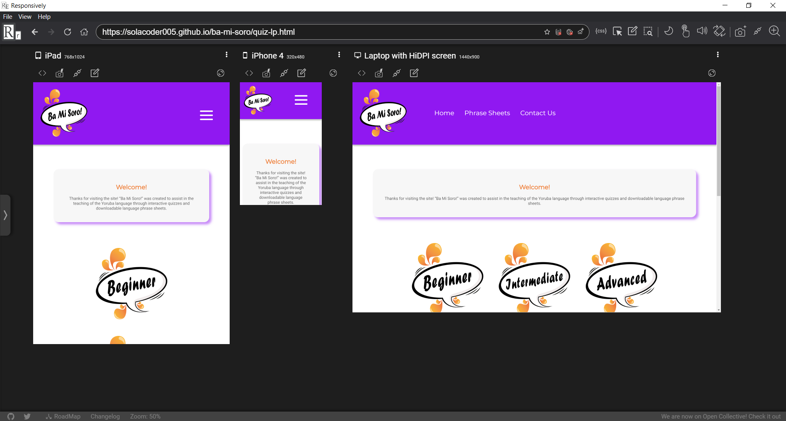

# List of Contents

1. [Overview](#1-Overview)
2. [User Experience (UX)](#2-User-Experience-UX)
3. [Content](#3-Content)
4. [Features](#4-Features)
5. [Technologies Used](#5-Technologies-Used) 
6. [Testing](#6-Testing)
7. [Deployment](#7-Deployment)
8. [Credits](#8-Credits)
9. [Acknowledgements](#9-Acknowledgements)
10. [References](#10-References)

## 1. Overview

# Ba Mi Soro! 

In a country that speaks over 200 languages, Yoruba is one of most common spoken languages in Nigeria, (spoken by more than 15% of the country’s population).

“Ba Mi Soro!” is a Yoruba phrase that translates to “Talk to me!”. The Ba Mi Soro (BMS) website provides interactive quizzes and phrase sheets designed to test users’ understanding of the Yoruba language. 

**Features Overview** 

There are three quizzes which vary in difficulty and the variation in difficult is reflected in the (downloadable) phrase sheets also. The quizzes have been designed to appeal to, and challenge, a variety of users (e.g. of different age groups and abilities in speaking Yoruba). 

## 2. User Experience (UX)

The [‘5 Planes of UX Design Model’ (5PUXD)](https://medium.com/designcentered/ux-design-5-planes-method-b1b1d6587c05#:~:text=The%20five%20planes%20%E2%80%94%20strategy%2C%20scope,the%20problem%20as%20a%20whole) provides **five** core principles used when creating websites and applications.These principles are: 

- Strategy
- Scope
- Structure
- Skeleton
- Surface

The **Strategy** and **Scope** plane in the 5PUXD model suggest that consumer trends, needs and competing services should be considered before designing applications. Arguably, these factors are essential to identifying the core deliverables of the application and its services being offered. It also helps designers clarify the applications’ relevance withing the respective industry and potential market demand.

As such, brief market research was conducted to gain insight into competing services (e.g. existing language applications) and user psychographics. It also helped identify BMS’ target audience and the perceived objectives (goals) of the site owner and users’ (first-time and re-occurring) who visit BMS. This is discussed in more detail below.

### **2.2 Competitor Analysis**

As part of competitor analysis, the following language applications were reviewed. Analysis of such applications assisted in the conceptualisation and creation of BMS’ User Experience Deign. 

Below is a list of some of the websites and applications reviewed:

- [Duolingo](https://www.duolingo.com/)
- [Rosetta Stone](https://www.rosettastone.co.uk/lp/s1rsu/?cmp=evrev&utm_campaign=AW_Brand_NU_UK_ENG_Rosetta_Stone&gclid=CjwKCAjwoNuGBhA8EiwAFxomA-wUuYgJm4qTl1x16lP-8O47sP59mbLy7LMuiLFO-BTCp52AsadiphoCwjMQAvD_BwE)
- [Babbel](https://begin.babbel.com/en_gb/new-multilanguage-selection/?bsc=gg_br_srh_eng_all&btp=default&gclid=CjwKCAjwoNuGBhA8EiwAFxomA3PV_ccC_oIURV3Jgk7urDH32H87msg8c2d4VLRV6cEboIpcTHM20xoCgp8QAvD_BwE&utm_content=292390365_17797833525_kwd-96813789_73803153885&utm_medium=cpc&utm_source=google)
- [Speak Yoruba (Android & iOS App)](http://www.speakyorubaapp.com/)
- [Yoruba 101 (Android & iOS App)](https://play.google.com/store/apps/details?id=air.yoruba101&hl=en&gl=US)
- [Learn Yoruba in easy steps (Android & iOS App)](https://play.google.com/store/apps/details?id=com.tenacity.android.yoruba)

**2.2.1 Valuableness of BMS** 

While the Yoruba language is commonly spoken in Nigeria, it can be argued that compared to ‘Romance languages’ (e.g. Spanish, French, Italian etc.); there are considerably fewer resources (e.g. classes, applications certified courses) that teach the language outside of the country. As such BMS intends to: 

- Add to the educational resources that teaches the Yoruba language. 
- Provide a taster of the language through interactive learning. 

**2.2.2 How does BMS differ competitors?**

As the core aim of the BMS is to add to educational resources that teaches Yoruba, the BMS does not differ considerably from other applications and websites that teach the Yoruba language. 

### **2.3 Key Psychographic(s)**

Prior to creating the BMS website, some market research was conducted in the hopes to gain insight into users’ expectations when engaging with resources designed to assist in learning a language.  

The following questions were sent to a group of users who have interest in and/or are actively learning language(s) aside from their mother tongue: 

1. Do you and/or peers (e.g. friends, children, siblings, parents, partner) communicate more than one language?

If you **cannot speak** multiple languages, but would be interested in learning to:

2. Why would you like to learn another language? 

3. Which type of resources would you like to engage with when learning another language: 
 
    - Conversation with others
    - Books
    - Applications (quizzes and games)
    - Videos (TV shows/ YouTube)
    - A mixture of the above

If you **can speak** multiple languages:
 
4. What other language(s) can you speak?

5. How did you learn to speak other language(s)? 

6. Did you use any of the following resources to aid your learning? 

    - Conversation with others
    - Books
    - Applications (quizzes and games)
    - Videos (TV shows/ YouTube)
    - A mixture of the above

7. If you were to teach, or are teaching younger peers (e.g. your children) additional language(s) (e.g. ‘your native tongue’), which resources do you feel they would respond well to when learning the language:  

    - Conversation with others
    - Books
    - Applications (quizzes and games)
    - Videos (TV shows/ YouTube)
    - A mixture of the above

The users’ responses were documented in the table below:

|Q/User| User 1 | User 2 | User 3 | User 4| 
|-------------|:-------------:|:-------------:|:-------------:|:-------------
|Q1.|N/A| N/A| N/A | N/A |

The key demographics and goals of users’ and site owners were identified through the findings derived from the market, competitor, and psychographic analysis. These factors are discussed in more detail below. 

### **2.4 Key Demographic(s)**

- Age: 8-50
- Sex: Men and Women

### **2.5 User stories: Site Owner and User goals**

#### **Goals: First-time user** 

1. Play an online quiz that can be accessed anywhere on different devices.

2. Test personal knowledge of the Yoruba language for leisure and educational purposes.

#### **Goals: Re-occurring user** 

3. Play an online quiz that can be accessed anywhere on different devices.

4. Test personal knowledge of the Yoruba language for leisure and educational purposes.

5. Strengthen ability in understanding the Yoruba language in more complex contexts (e.g. increased comprehension). 

#### **Goals: Site Owner** 

6. Provide a front-end accessible quiz. 

7. Ensure that the quiz can be accessed by users on most devices (i.e phone, tablet, laptops, and desktops).

8.  Provide content that:

    - Assists user’s knowledge and development of the Yoruba language.
    - Challenges users’ varying ability and/or understanding of the Yoruba language.
    - Can help different age-groups learn Yoruba.

9. Provide users with feedback on their quiz score.

10. Gain users’ feedback on the usefulness of the application.

## 3. Content

This section discusses various design elements of the BMS website. Formulating and executing such elements were integral the development of the BMS site. Arguably, consideration of these factors echoes the premises of the latter planes of the 5PUXD Model. For instance, when designing the BMS site, it was essential to identify the required information of the site (structure) and how users can access this content (skeleton).

### **3.1 Wireframes** 

The wireframes below were drawn up before physically creating the BMS site. Each page shall be discussed in more detail in the features section of this README. Creating the preliminary mock-ups of the BMS site helped to highlight the limitations and strengths and weakness of the BMS design. It also allowed a more accurate analysis of which design elements were feasible to execute within the project time frame and which could be implemented if the BMS site could be expanded on if the project development were extended.   

#### **Initial wireframes (above)** 

The initial wireframes above were greated for the BMS site. However, at later stages of the site's development, additional wireframes were created to clarify yhte current structure of the BMS website. 

#### **Reviewed wireframes (below)** 

Revisions were made to the wireframes after assessing the degree to which the website's design could be executed effectively. 

Given the complexity of the initial website design, factors such as programming skill level, and project timeframe informed the perceived feasibility of creating the site. In turn, these considerations influenced the amendment of the website's initial wireframes. 

The wireframes for the website's current design can be found in the following [directory](/docs/wireframes).

### **3.2 BMS Logo**

The logo for the site was created and illustrated through the following software:

- Adobe Illustrator
- Adobe Photoshop
- Adobe InDesign 

Arguably, language is a salient factor of effective communication. With this in mind, the speech bubble has been used as the logo’s primary form as the shape is one of the most iconic and universally known symbols used to connote speech, language and communication. 

With reference to colour choice, the orange shapes were used to convey the idea of ‘popping’/ lively conversation. This concept also influenced the decision to use the colour orange as it too is often used to convey liveliness and evoke positive moods. Further, orange is commonly used in learning resources (Shiftelearning.com, 2019). 

### **3.3 Fonts**

 

- **Monserat**: To compliment the BMS logo, this san-serif font was used primarily for the headings included on the site. The letters are spaced out considerably and therefore likely to have greater readability than script typography. 

- **Roboto**: When previewed on Google fonts, this font appeared to compliment Monserat the most and it too is rounded which often conveys soft tones and perceived approachableness. 

### **3.4 Colour Pallet**

The following colours were use on the BMS site. The colours’ rgba values were used in the source code rather than the hex values as the rgba values allowed the opacity of the colours to be adjusted where needed and reduce verboseness within in the css source-code. Moreover, the colours’ opacity was adjusted in some instances to convey depth and subtle differences.

- [#FF0000](https://www.webfx.com/web-design/hex-to-rgb/#FF0000/)
- [#EF823E](https://www.webfx.com/web-design/hex-to-rgb/#EF823E)
- [#9ACD32](https://www.webfx.com/web-design/hex-to-rgb/#9ACD32)
- [#9018F1](https://www.webfx.com/web-design/hex-to-rgb/#9018F1)
- [#5D5D5D]( https://www.webfx.com/web-design/hex-to-rgb/#5D5D5D)
- [#5A5757](https://www.webfx.com/web-design/hex-to-rgb/#5A5757)
- [#FFFFFF](https://www.webfx.com/web-design/hex-to-rgb/)

## 4. Features

This section provides an overview of the features on the BMS  website, and where relevant, the way in which theses feature(s) address the users’ stories, mentioned in prior sections.

### **Site-wide features**

1. Logo 

    - The logo is static on the enter-site landing page and has been included to establish the name of the site.The logo in the top right of BMS’ header allows the user to return back to the homepage.

2. Social Media links (Footer) 

    - The footer’s social media links allow the user to access the BMS’ social media profiles on LinkedIn, Instagram and Twitter.

3. Navigation Menu

    - The navigation menu has been placed on the primary sites and the quiz sites to aid easier navigation for the user. 

    - The navigation menu is presented in a horizontal line on devices that have a screen width size larger than 800px.  

    - Devices that have a screen-size smaller than 768px will present an expandable and collapsing menu, often titled as a ‘Hamburger menu’. The menu has been created this way to aid user experience and support effective UXD and UI functionalities (e.g. device responsivity). 

| Goal Number| Description| User Stories - Supporting Statement|
|-----|-----|-----| 
| 7. | Ensure that the quiz can be accessed by users on most devices (i.e phone, tablet, laptops, and desktops)| N/A| 

### **4.1 Enter Page**

1. Central Logo 

    - The logo is static and is only used to establish the name of the site. 

2. ‘Enter’ Button

    - This feature has been centred intentionally and under the logo to communicate clear instructions to the user. 
    
    For instance, to ‘enter’ the site they need to click the button. To bolster this message, the button’s text turns to orange and the cursor turns into a pointer when the user hovers over the button. 

| Goal Number| Description| User Stories - Supporting Statement|
|-----|-----|-----| 
| 7. | Ensure that the quiz can be accessed by users on most devices (i.e phone, tablet, laptops, and desktops)| N/A| 

### **4.2 Quiz Landing page**

1. Quiz Icons

    - The quiz icon links; ‘Beginner’, ‘Intermediate’ and ‘Advanced’ link to separate quizzes which content varies difficulty. This shall be discussed in latter sections. 

    - When hovered over, the icons enlarger slightly to communicate that the links are active and clickable. To add to this the cursor changes to a pointer when the user hovers over each. 

    - The icons are presented in a horizontal line on devices that have a screen width size larger than 800px.  

    - Devices that have a screen-size smaller than 768px will present the icons vertically to aid user experience and support the site’s responsiveness capabilities. 
    
2. Icons 

    - The icons presented int the latter part of the page links to additional sections and pages on the site.  

| Goal Number| Description| User Stories - Supporting Statement|
|-----|-----|-----| 
| 7. | Ensure that the quiz can be accessed by users on most devices (i.e phone, tablet, laptops, and desktops)| N/A| 

#### **4.2.1 The Quizzes - Beginner, Intermediate and Advanced Quiz**

1. Question complexity

    - Each level presents 5 questions that vary in complexity. For instance:

**Level: Beginner**
- Purpose: Test the user’s trivia knowledge of the Yoruba language. 

- How: The questions are written in English where the user, is asked to identify the correct Yoruba syntax. 

- Knowledge capability: The user would have no and/or limited knowledge of the Yoruba language.

**Level: Intermediate**
- Purpose: To test the user’s understanding and comprehension of some Yoruba sentences.

- How: The user is asked to complete the presented sentence with the correct Yoruba word. To do this correctly, the user will likely have a deeper understanding of Yoruba grammar. 

- Knowledge capability: The user would have a basic understanding and knowledge of the Yoruba language and grammar. 

**Level: Advanced**
- Purpose: To test the user’s understanding and comprehension of conversation spoken in a Yoruba language.  

- How: The user is asked to pick the correct answers in relation to the story presented. The story is written in Yoruba, however, to aid users understanding – the answers are written in English. This quiz is also designed to test Yoruba language and grammar.

- Knowledge capability: The user is likely to be more accustomed to auditory and verbal interactions with the Yoruba language.  

2. Multiple choice buttons

    - Each question is presented within a box, where each option is presented in a circular-button. 

    - The button lights up, forming an orange ring when the user hovers over the element.
    
    - Once clicked the buttons turn either red or green depending whether the answer is correct.

3. Question Tracker

    - Once each button is clicked, the questions tracker increases. Based on the JavaScript code, each question is randomised, therefore the questions will be presented in a different order each time the quiz is loaded/refreshed in the browser window. 

4. Points tally tracker

    - Depending on the answers chosen, each correct answer is awarded 15 points, if incorrect, 5  points are deducted. The points tally records the user’s points accumulated over the course of the quiz. 

    - At the end of the quiz, the user will be directed to the score page. This shall be discussed in latter sections. 

| Goal Number| Description| User Stories - Supporting Statement|
|-----|-----|-----| 
|1. | Play an online quiz that can be accessed anywhere on different devices.|N/A |
|4. |Test personal knowledge of the Yoruba language for leisure and educational purposes.| N/A| 
|5. |Strengthen ability in understanding the Yoruba language in more complex contexts (e.g. increased comprehension) | N/A| 
|6. | Provide a front-end accessible quiz. | N/A|  
|8. | Provide content that: (1) Assists user’s knowledge and development of the Yoruba language, (2) Challenges users’ varying ability and/or understanding of the Yoruba language and (3) Can help different age-groups learn Yoruba.| N/A| 
|9. | Provide users with feedback on their quiz score. |N/A | 

#### **4.2.1 Score page**

1. Buttons 

    - Each button serves a function such as returning users to the homepage or quiz landing page to play the quizzes again.

    - Akin to the other buttons on the site, the buttons presented on this page turn orange when thew user hovers over it. 

    - The ‘VIEW SCORE’ button reveals the user’s total points gained throughout the quiz. Clicking on the button. 

2. Confetti feature

    - This feature is activated once the user completes the quiz and then active again once the ‘VIEW SCORE’ button. This has been added to increase the informal tone of the overall BMS site. 

| Goal Number| Description| User Stories - Supporting Statement|
|-----|-----|-----| 
|N/A|N/A|N/A | 

### **4.3 Phrase Sheets page**

1. Beginner, Intermediate and Advanced Phrase Sheets

    - Akin to the quiz levels, this page provides users with phrase sheets. Each sheet provides useful phrases that can be used in Yoruba spoken conversations. 

    - As the language is complex and the BMS site is designed to provide users with a taster of the language through quizzes, the sheets provide a small selection of phrases. 

    - While these can help the user answer some of the the quiz questions, it is highly advised that users develop their knowledge with certified and supplementary learning resources (e.g. videos, lessons, and conversions) to develop their knowledge further. 

2. Download function

    - Akin to the other button functions on this page, the download buttons change colour, in this case to purple, when hovered over. 

    - Once the buttons are clicked, the phrase sheets automatically download to the persons device. This works on desktop, android, and mobile devices.

| Goal Number| Description| User Stories - Supporting Statement|
|-----|-----|-----| 
|5. | Strengthen ability in understanding the Yoruba language in more complex contexts (e.g. increased comprehension). |N/A | 
|8. | (3) Can help different age-groups learn Yoruba. |N/A | 

### **4.4 Contact Us form page**

- The form has been created to receive users’ feedback. A text box has been used rather thank multiple choice questions as it allows the user to provide qualitative feedback. Feedback of this nature can help the site owner analyse how the site and its quizzes can be developed to bolster users’ experience.

- The form has been tested and submits successfully. 

| Goal Number| Description| User Stories - Supporting Statement|
|-----|-----|-----| 
|10. | Gain users’ feedback on the usefulness of the application. |N/A | 

### **4.5 404 page**

1. Central Logo 

    - The logo is static and is only used to establish the website's brand and that the user has tryied to access an incorrect page. 

2. ‘Enter’ Button

    - This feature has been centred intentionally and under the logo to communicate clear instructions to the user. For instance, to ‘return’ to the site they need to click the button. 

    - To bolster this message, the button’s text turns to orange and the cursor turns into a pointer when the user hovers over the button. 

### **4.6 Future Features**

In review of the BMS the project could be improved through a plethora of features. These could be implemented in future developments of the BMS site. Some of these features have been listed below: 

**Quiz images**

- Images included with the questions can aid users’ learning. This would be particularly beneficial to users who have a stronger spatial intelligence, as outlined in [Gardener’s Multiple intelligence theory](https://www.simplypsychology.org/multiple-intelligences.html) (Marenus, 2020).

**Auditory Questions**

- Similarly, audio-based questions could not only present another challenging aspect of the quiz, it may also benefit users that have stronger musical and linguistic intelligences. 

**Playlist of video resources** 

- Akin to the feedback from user stories, including an online playlist (e.g. hosted via YouTube) could make the BMS site more useful. / link to amazon bookstore for further literary resources. 

**Increasing the quantity of quiz questions** 

- Arguably, increasing the amount of questions for each quiz would create more of a challenge for the users. Based on the averages person’s short-term memory abilities, it is not difficult to memorise small chunks of simple information (e.g. answers). 

- As such, a key limitation of the current quizzes is that, 5 questions per quiz will typically allow re-occurring users to memorise the correct answers. 

**Hiding the quiz score and including a High score page**

- Implementing these features could make the quiz more challenging. Arguably, these features would cause users to rely more of their knowledge and determine their understanding based on the end results.

**Adding additional animations**

- Adding animations to elements such as the quiz buttons when clicked could make the quiz look more appealing specifically for users of younger age groups. 

## 5. Technologies Used

### **5.1 Languages**

- **HTML**: This source code supported the fundamental structure of the website. 

- **CSS**: This source code supported the core styling elements of the website.

- **JavaScript**: This source code supported the dynamic features/capabilities of the website. 

For instance;

-  JS script was used to instigate the colour change of the quiz buttons when the right or wrong answers were clicked on.  

- JS script was also used to enable the hiding and appearing function of the scores once the quizzes were completed. elements of the website. 

- **JQuery**: Supported specific functionalities (e.g. the scroll button) within the site through simplifying ‘Document Object Model’ (DOM) manipulation (Developer.mozilla.org, 2021).

### **5.2 Applications, Libraries and Resources**

-	[Adobe Creative Cloud](https://www.adobe.com/uk/creativecloud.html): 
    - Illustrator (AI)
    - Photoshop (PS) 
-   [Balsamiq]( https://balsamiq.com/)
-   [Bootstrap](https://getbootstrap.com/)
-   [Cite This for Me](https://www.citethisforme.com/)
-   [Font Awesome](https://fontawesome.com)
-   [GitHub](https://github.com/)
-   [GitPod](https://www.gitpod.io/)
-   [Google (Chrome) Development Tools](https://developer.chrome.com/docs/devtools/open/)
-   [Google Fonts](https://fonts.google.com/)
-   [Google Translate](https://translate.google.co.uk/)
-   [Pexels](https://www.pexels.com/)
-   [Pixabay](https://pixabay.com/) 
-   [Pinterest](https://www.pinterest.co.uk/) 
-   [Responsively](https://responsively.app/download) 
-   [Stack Overflow](https://stackoverflow.com/)
-   [VSCode](https://code.visualstudio.com/)
-   [W3 Schools](https://www.w3schools.com/)
-   [W3.CSS](https://www.w3schools.com/w3css/default.asp) 
-   [Youtube](https://www.youtube.com/) 

### **5.3 Testing Applications** 

The following applications were used to test various aspects of the website. Meeting these requirements were essential to the BMS site complying with accessibility, coding and performance standards within the programming industry.

-   [Dillinger](https://dillinger.io/)
-   [(Jigsaw) Validator](https://jigsaw.w3.org/css-validator)
-   [JSHint](https://jshint.com/)
-   [Lighthouse](https://developers.google.com/web/tools/lighthouse)
-   [Wave](https://wave.webaim.org/)
-   [W3C Validator](https://validator.w3.org/)

## 6. Testing

### 6.1 **HTML, CSS and JS Validator Tests**

To ensure that the HTML, CSS and JS source-code adhered to industry standards, each were ran through respective validators – [W3C Validator](https://validator.w3.org/), [(Jigsaw) Validator](https://jigsaw.w3.org/css-validator) and the [JShint Validator](https://jshint.com/). All the tests produced **0 errors**. Evidence of the tests can be found in the testing repository directory, [here]().

### **6.2 WAVE: Website Accessibility Test**

The [WAVE Accessibility Evaluation Tool](https://wave.webaim.org) was used to evaluate the overall accessibility of the BMS site. It considered factors such as the quantity and suitability of accessibility features used on the website (e.g. aria-labels, degree of contrast). The results produced **0 errors**, thus passing the overall test. However, there were some contrast errors which have not been altered due to design preferences. Evidence for the results of each page can be found [here](docs/testing/wave-results). 

### **6.3 LIGHTHOUSE: Website Performance test**

The [Lighthouse](https://developers.google.com/web/tools/lighthouse#devtools) was used to test the performance of the BMS website. In relation to performance, the tests indicated that the website will operate at an optimal level on desktop devices where each page achieved a score between **91-99 out of 100**. Evidence for the results of each page can be found [here](docs/testing/lighthouse-results).

### **6.4 Website Responsiveness**

Regarding the website’s degree of responsiveness, the site was accessed on multiple devices (incl. mobile, tablets, desktop, and larger devices) and multiple browsers (incl. FireFox, Google Chrome and Microsoft edge). The BMS site appears to respond appropriately to the changing device screen sizes and altering of browser’s size. Evidence of this is provided below: 

### **6.5 Bugs**

While there were several bugs that arose through the duration of the project, the most notably fixed and unfixed bugs are discussed in more detail below. 

#### **6.5.1 Fixed bugs**

**1. JShint Error message**
 
|_”arrow function syntax (=>)' is only available in ES6 (use 'esversion: 6')”_|

- **Context:** While testing the JavaScript through the JShint validator, the following error kept arising: **_”arrow function syntax (=>)' is only available in ES6…”_**.

- **Reason:** The JavaScript code uses new ECMAScript 6 (ES6) abbreviations of traditional JS code. While it is not supported by all browsers, it is supported by many. As such, ES6 was designed to help programmers reduce code verbosity. For instance, in this case the ‘=>’ function in JS code is often used to shorten the function syntax. Similarly, rather than using bracket notation;  property accessors such as  dot notation is often used to shorten code (W3Schools.com, 2021, Hayani, 2018 & Rafael, 2017).  

- **Fix:** This error was resolved by using the following syntax:

|/*jshint esversion: 6 */|

    This was placed at the top of the JavaScript source-code as it communicates to the validator that ES6 syntax is being used intentionally.

**2. Redirecting users to another page via JavaScript**

- **Context:** As part of the quiz, it was essential for the users to be directed to the Score page on the BMS once the quiz had been completed. Initially, the following JS syntax was used: 
|JS Statement|
|------|
| _window.location(“/quizEnd.html”);_|

    Running this page locally hosted port (Port: 5500) successfully directed to the score page once the game was completed. However, this code continually produced an error when the site was deployed to the live published page, via Github.com. 

- **Reason:** This bug was arising as the code was running on the local repository and therefor was able to run the local quizEnd.html file. 

- **Fix:** This error was resolved by changing the pathway of the page to redirect to. To do this, the following code was used and redirected to the official deployed URL: 

_window.location.assign(“https://solacoder005.github.io/ba-mi-soro/quiz-end.html”);_

**3. JShint Error message: “_____________ undefined variable”**

- **Context:** When running script through the JShint validator the variables ‘bodymovin’ and ‘$’ operator produce returned values as ‘undefined’. When attempting to define the variables in the script, the animation and jQuery features are deactivated. 

- **Reason:** The reason for this error was that the variables were not defined initally.

- **Fix:** Given that the variables were being used in a block of code, each were declared as ‘var’ variables rather than ‘let’ and/or ‘const’. Decalring the variables this way allowed the animation and toggle features execute successfully. 

#### **6.5.2 Unfixed bugs**

**1. Multiple JS Code functions will not run on one page**

- **Context:** The primary unfixed bug that should be addressed if this project is developed is reducing the amount of JS code sheets included in the repo. 

- **Reason:** 

    The repo has multiple JS files for a few reasons: 

    (1) During the initial stages of writing the script, the functions were created and ran on the site individually. It was then combined into one sheet where possible.

    (2) As the quizzes vary in difficultly, the structure of questions varied also. As such it became a conscious decision for the questions not to be combined into one quiz. In reflection, the use of ‘fetch ()’ method and web APIs would provide a more sufficient and effective solution to presenting differing question based on difficulty. 

    (3) The developer was unable to find a solution to successfully run multiple functions from one JavaScript. While each worked individually, when combined into one file; some functions would not execute successfully, whereas others would. 

- **Potential Fix:** Implement the fetch() method with the use of a Web API to the JS source code. This will be considered and implemented in future projects. 

## 7. Deployment

### 7.1 Deployment: Local Clone 

The Ba Mi Soro website was deployed locally via the use of GitHub (web application), Git Bash, an IDE such as VS Code (desktop application, and the use of a ‘repo’ - specific SSH Key. An overview of how the site was deployed locally is discussed in more detail below: 

|The Process| 
|-------------|
|Note: You will need this key to clone your repo to your local space (e.g. on your desktop).|
|1.	Download the GitBash application and create a SSH key. How to create a SSH key can be found [here]( https://inchoo.net/dev-talk/how-to-generate-ssh-keys-for-git-authorization/).|
|2.	Sign into [GitHub](https://github.com/).|
|3.	Click your profile icon in the top-right corner of the GitHub webpage, click **Settings**.|
|4.	Click SSH and GPG Keys tab on the left-hand menu.|
|5.	Click **‘New SSH Key’**, then copy and paste your key code (created via GitBash) into the box under the **’Key’** title.|
|6.	Click **’Add SSH Key’**., your key will then be ready to use!|
|7.	Click the **’+’** icon in the top-right icon on the web browser and select **‘New Repository’**. You will then be directed to a webpage titled ‘Create a new repository’.| 
|8	Fill out the required areas. Ensure the repository has been assigned a name and has a README.md created. The README file can be added by selecting the **'Add a README file'** option at the bottom of the ‘Create a new repository’ form.|
|9. Copy your SSH key from your repo. To do this:
|9.1 Open GitHub and navigate to the repo you want to clone.|
|9.2 Click the **’Code’** button in the top-right corner of your repo window.|
|9.3 Click the SSH Key tab.|
|9.4 Copy the SSH key via right click and copy or clicking the clipboard icon.|
|10. On your desktop, open VSCode.|
|11. On the taskbar at the top of tab, click the **File** tab.|
|12. Select the folder you want to clone your repo to.|
|13. In the terminal box, type **‘git clone’**.|
|14. Then copy your SSH key after the git clone command. Then press enter.|
|15. The terminal should present the pathway to your cloned repository. For instance, this “Ba Mi Soro!” project will display the following in the VSCode’s terminal:| 
|- **…C:\Users\missm\Documents\GIT\ba-mi-soro>**|
|16. Once cloned, you will be able to edit your repo locally and commit, pull and push changes to your online GitHub repo (remote repository) using terminal commands (e.g. 'git push', 'git add .' and 'git pull').| 

### 7.2 Deployment: GitHub Pages

Below is an overview on how to deploy a project via GitHub’s GitHub Pages. This method was used to deploy the “Ba Mi Soro!” website:

|The Process| 
|-------------|
| 1. Create a project **repository** on [GitHub](https://github.com/) using a registered GitHub account.|
|2. Once the repository is created, click on the repository, then the **Settings** tab, this is the last tab in the top right of the repository’s **navigation bar**.|
|3. Once on the settings page, navigate to and click on **Pages** (titled as ‘Pages’ as of May 2021) listed in the left-hand menu pane.|
|4. Under the header - **Source**, select **master branch**  from the drop-down list. This will change the neighbouring selector box to **/(root)**.|
|5. Then click **Save**.|
|6. Wait for a minute and then **refresh** the webpage.|
|7. Once refreshing, a green box with the text and clickable link; **'Your site is published at...'**.| 
|8. Clicking on the website’s hyperlink in the green box will direct to the live deployed website.|

## 8. Credits

### **8.1 The Project** 

#### **8.1.1 Project Goals**

- This website is the final product of the Portfolio Project 2: JavaScript Essentials (a.k.a. Milestone Project 2, MS2).  It is part of the Code Institutes’ (CI) Diploma in Full Stack Software Development Diploma (5P).

#### **8.1.2 Chosen Project Idea** 

- Out of several ideas presented, Project Idea 0 was chosen. However, to provide more conceptual structure to the project, the website uses the concepts presented in Project Idea Example 2 as a point of reference as it asked to ‘Build an Online Quiz’. Specifically, the quiz was designed to test ‘literary knowledge’ of the Yoruba language.

### **8.2 Content** 
Although some of the resources credited below are already listed in the [5. Technologies Used](#5-Technologies-Used) section of the README and [References section](#10-References); the credits listed here are relative to specific content that has been incorporated into the Ba Mi Soro website:

- Nav Menu  

Tutorials created by [Pop (2020)](https://www.youtube.com/watch?v=ydZc17rlR5E&list=PLH7H7OKKWG3T0SAJxSVBxr-Qz-219iWeH&index=19) and [codeSTACKr (2019)](https://www.youtube.com/watch?v=dIyVTjJAkLw&list=PLH7H7OKKWG3T0SAJxSVBxr-Qz-219iWeH&index=7) influenced the structure of the Navigation menu code was influenced by the YouTube tutorials presented by Direct references can be found in the References section [below](#10-References).

- CSS Grid 

Tutorial created by [Angela Delise(2020)](https://www.youtube.com/watch?v=68O6eOGAGqA&list=PLH7H7OKKWG3T0SAJxSVBxr-Qz-219iWeH&index=16&t=681s) and [codeSTACKEr (2019)](https://www.youtube.com/watch?v=0-DY8J_skZ0&list=PLH7H7OKKWG3T0SAJxSVBxr-Qz-219iWeH&index=15&t=971s) assisted the develpers understanding and implementation of CSS grids. 

- Quiz functional logistics

[Traversy Media’s (2016)](https://www.youtube.com/watch?v=kVc_XfZY0vI&t=69s) and [J. Q. Quick’s (2019)](https://www.youtube.com/playlist?list=PLDlWc9AfQBfZIkdVaOQXi1tizJeNJipEx) tutorial informed influenced the construction of the Ba Mi Soro quizzes. Direct references to this tutorial can be found in the   References section [below](#10-References). 

- [Code Institute](https://learn.codeinstitute.net/ci_program/diplomainsoftwaredevelopmentecommerce): The Code Institute's lesson and challenges has been referred to help with the construction and functionality of the site. For instance: 

    - Form validation URL: The Code Institute’s URL (https://formdump.codeinstitute.net) has been incorporated into the form on the ‘Contact Us’ page of the website. The tutorial can be found [here](https://learn.codeinstitute.net/courses/course-v1:CodeInstitute+HE101+2020/courseware/fcc67a894619420399970ae84fc4802f/ee2afa91c35e4268b7de2ea21fe311dd/9?activate_block_id=block-v1%3ACodeInstitute%2BHE101%2B2020%2Btype%40vertical%2Bblock%4004ae28359c4340048efdeeacf3363eb0).

-   [Font Awesome](https://fontawesome.com/): The icons used on the website has been sourced from Font Awesome.

-   [Google Fonts](https://fonts.google.com/): This was used to select and import the desired font into the website’s stylesheet. 

-   [Stack Overflow](https://stackoverflow.com/): This was used as a reference tool to assist with troubleshooting both HTML, CSS and JavaScript code issues. 

-   [W3 Schools](https://www.w3schools.com/): This was used as a reference tool to assist with HTML coding techniques. 

-   [Youtube](https://www.youtube.com/): This was used to refer to useful coding and UXD tips and tutorials. Including: 

### **8.3 Language and Scripts**

- **JavaScript:** The JavaScript used within the source-code assists with specific functionalities (e.g. Navigation Menu, Scroll button, and Icons). The scripts have been sourced from the following sites: 

- Font Awesome: https://kit.fontawesome.com/1699136767.js

- bodymovin: https://cdnjs.cloudflare.com/ajax/libs/bodymovin/5.7.11/lottie.min.js

Similarly, The jQuery used within the source-code assists with specific functionalities as mentioned earlier. The script has been sourced from jQuery.com. A direct reference to how to use the jQuery in source-code can be found in the References section [below](#10-References):

- Jquery.com: https://code.jquery.com/jquery-3.6.0.min.js

### **8.4 Media** 

- [LottieFiles.com](https://lottiefiles.com/): Score Page animation

Specifically the animation used on the BMS’ score page was created by [Arvind Lakhani](https://lottiefiles.com/7434-confetti). The **colour scheme and speed** of the animation was adapted by the developer to fulfil the needs of the BMS website. Further, a tutorial by [DesignCourse (2021)](https://www.youtube.com/watch?v=x8WW0DDXZ4w&list=PLH7H7OKKWG3T0SAJxSVBxr-Qz-219iWeH&index=22) provided an example of how to implement the animation into HTML and JS code. 

## 9. Acknowledgements
## 10. References

### Books

- **C.P.A Inc., 2019.** The Computer Programming Bible. 1st ed. C.P.A Inc.

- **Duckett, J., 2014.** JavaScript & JQuery: Interactive Front-End Web Development. John Wiley & Sons.

- **DuRocher, D., 2020.** HTML and CSS QuickStart Guide. 1st ed. ClydeBank Media LLC.

### Online Resources 

- [Code Institute, 2020. Anna Greaves README Video](https://www.youtube.com/watch?v=7BteidgLAyM&list=PLH7H7OKKWG3QDcR2PuS9_JGeh6Q_5EUWl&index=2&t=427s)

- [codeSTACKr. 2019. Learn CSS Grid in 20 Minutes](https://www.youtube.com/watch?v=0-DY8J_skZ0)

- [codeSTACKr. 2019. Animated Hamburger Menu Tutorial – CSS Effects](https://youtu.be/dIyVTjJAkLw)

- [C., R., 2021. Arrow function syntax (=>) is only available in ES6 (use 'esversion: 6'](https://stackoverflow.com/questions/42866159/arrow-function-syntax-is-only-available-in-es6-use-esversion-6)

- [Delise, A., 2020. Responsive CSS Grid Tutorial](https://www.youtube.com/watch?v=68O6eOGAGqA&list=PLH7H7OKKWG3T0SAJxSVBxr-Qz-219iWeH&index=16)

- [DesignCourse, 2021. Add AMAZING Animations with LottieFiles - SO EASY](https://www.youtube.com/watch?v=x8WW0DDXZ4w&t=549s)

- [Do, Q., 2016. A table row was 2 columns wide, which is less than the column count established by the first row (3)](https://stackoverflow.com/questions/36951492/a-table-row-was-2-columns-wide-which-is-less-than-the-column-count-established)

- [ESLint - Pluggable JavaScript linter. 2021. Rule dot-notation](https://eslint.org/docs/2.0.0/rules/dot-notation)

- [freeCodeCamp.org. 2020. How to Center Anything with CSS - Align a Div, Text, and More](https://www.freecodecamp.org/news/how-to-center-anything-with-css-align-a-div-text-and-more)

- [Gallagher, J., 2021. Document.getElementByID is not a function Solution | Career Karma](https://careerkarma.com/blog/javascript-document-getelementbyid-is-not-a-function/#:~:text=The%20JavaScript%20getElementById%20method%20selects,function%20error%20in%20your%20program)

- [GeneratePress. 2021. Tom - Lead Developer | 15th April 2016 #187200 | Shadow under nav bar - GeneratePress](https://generatepress.com/forums/topic/shadow-under-nav-bar)

- [Google Fonts. 2021. Google Fonts](https://fonts.google.com/specimen/Montserrat?category=Sans+Serif,Display#standard-styles)

- [Hayani, S., 2018. JavaScript ES6 — write less, do more](https://www.freecodecamp.org/news/write-less-do-more-with-javascript-es6-5fd4a8e50ee2/#:~:text=JavaScript%20ES6%20brings%20new%20syntax,destruction%2C%20Modules%E2%80%A6%20and%20more)
 
- [Hibbard, J., 2014.Why does JSHint throw a warning if I am using const?](https://stackoverflow.com/questions/27441803/why-does-jshint-throw-a-warning-if-i-am-using-const)

- [js.foundation, J., 2021. Code.jquery.com.](https://code.jquery.com/)

- [Krossing, D., 2017. 2: How to add jQuery to your website | Learn jQuery | jQuery tutorial](https://www.youtube.com/watch?v=EwUOsRlDTLQ)

- [Marenus, M., 2020., Gardner's Theory of Multiple Intelligences](https://www.simplypsychology.org/multiple-intelligences.html)

- [Media, T., 2016. jQuery Crash Course [4] - Effects and Animation](https://www.youtube.com/watch?v=kVc_XfZY0vI&t=69s)

- [Mylanguages.org. 2021. Yoruba Phrases](http://mylanguages.org/yoruba_phrases.php)

- [Pop, F., 2020. Responsive Navigation with Hamburger Menu - CSS And JavaScript Tutorial](https://www.youtube.com/watch?v=ydZc17rlR5E)

- [Quick, J. Q., 2019. Build a Quiz App with HTML, CSS, and JavaScript](https://youtube.com/playlist?list=PLDlWc9AfQBfZIkdVaOQXi1tizJeNJipEx)

- [Shiftelearning.com. 2019.The Psychology of Color: How Do Colors Influence Learning?](https://www.shiftelearning.com/blog/how-do-colors-influence-learning)

- [Ulman, S., 2019. What is the meaning of "$" sign in ](https://stackoverflow.com/questions/1150381/what-is-the-meaning-of-sign-in-javascript)

- [Worthington, J., 2021. Hobbies and Interests - UK - February 2021](https://reports.mintel.com/display/1065935/?fromSearch=%3Ffreetext%3Dlearning%2520language)

- [W3schools.com. 2021. CSS3 Media Queries - Examples](https://www.w3schools.com/css/css3_mediaqueries_ex.asp)

- [W3schools.com. 2021. CSS Shadow Effects](https://www.w3schools.com/css/css3_shadows.asp)

- [W3schools.com. 2021. How To Create a Download Link](https://www.w3schools.com/howto/howto_html_download_link.asp)

- [W3schools.com. 2021. How To Create Responsive Images](https://www.w3schools.com/howto/howto_css_image_responsive.asp) 

- [W3schools.com. 2021. JavaScript Arrow Function](https://www.w3schools.com/js/js_arrow_function.asp)

- [W3schools.com. 2021. JavaScript Window Location](https://www.w3schools.com/js/js_window_location.asp)

